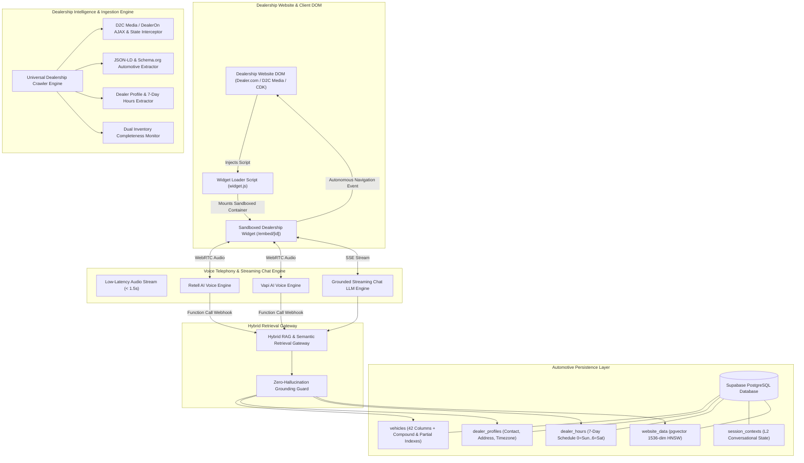
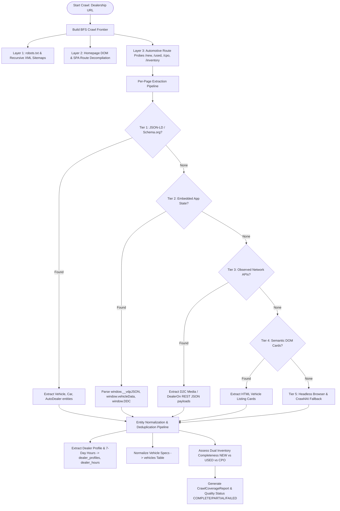
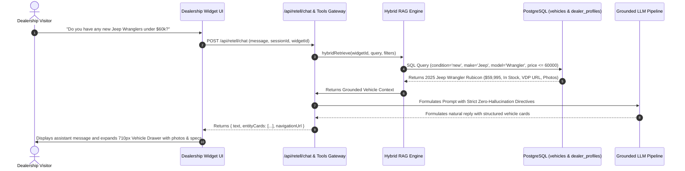

# 🚗 Automotive Dealership AI Voice & Conversational Intelligence Platform

[](https://www.typescriptlang.org/)
[](https://nextjs.org/)
[](https://www.postgresql.org/)
[](https://www.prisma.io/)
[](https://www.retellai.com/)
[](https://vapi.ai/)

An enterprise-grade, embeddable **AI Voice & Streaming Chat Agent** engineered specifically for automotive dealerships. The platform autonomously crawls dealership websites across all major automotive CMS architectures (Dealer.com, D2C Media, DealerOn, DealerInspire, CDK Global, WordPress), extracts structured NEW, USED, and CPO vehicle inventories, synchronizes dealer profiles and 7-day business hours, and powers real-time conversational agents capable of sub-1.5s WebRTC voice telephony, grounded inventory retrieval, dynamic budget filtering, and autonomous browser navigation.

---

## 📑 Table of Contents

1. [System Architecture](#-system-architecture)
2. [Key Capabilities & Automotive Features](#-key-capabilities--automotive-features)
3. [Universal Dealership Crawler Subsystem](#-universal-dealership-crawler-subsystem)
4. [Automotive Data Foundation & Schema Architecture](#-automotive-data-foundation--schema-architecture)
5. [Conversational AI & Hybrid RAG Engine](#-conversational-ai--hybrid-rag-engine)
6. [Autonomous Host Page Navigation Bridge](#-autonomous-host-page-navigation-bridge)
7. [Real-Time WebRTC Voice Telephony](#-real-time-webrtc-voice-telephony)
8. [Abuse Prevention & Spend Circuit Breakers](#-abuse-prevention--spend-circuit-breakers)
9. [Complete API Reference](#-complete-api-reference)
10. [Environment Configuration](#-environment-configuration)
11. [Local Development & Verification Suites](#-local-development--verification-suites)

---

## 🏛 System Architecture



---

## ⚡ Key Capabilities & Automotive Features

- **Complete Inventory Understanding**: Distinguishes **NEW**, **USED**, and **CPO (Certified Pre-Owned)** vehicles, tracking VINs, stock numbers, trim packages, drivetrains (AWD/4WD/FWD/RWD), transmissions, engine displacement, fuel types, fuel economy, and odometer mileage.
- **Dual Fuel Efficiency Ingestion**: Accurately crawls and indexes both City and Highway fuel consumption (`L/100km` or `MPG`), enabling queries like *"Which SUVs have the best highway fuel economy?"*.
- **Dealership Operations & 7-Day Hours**: Dedicated extraction and persistence of dealership contact numbers (Sales, Service, Parts), physical addresses, and 7-day business hours (`0=Sunday` to `6=Saturday`) without duplicating schedules onto individual vehicle rows.
- **Grounded Anti-Hallucination Guard**: The agent only answers based on verified in-stock vehicles. Missing prices are marked as *"Call for price / Unlisted"* rather than fabricated. Missing VINs or specifications are handled cleanly with `NULL` preservation.
- **Autonomous Host Navigation**: Visitors asking *"Show me used Ram 1500 trucks"* or *"Open the 2025 Jeep Grand Cherokee page"* trigger direct browser redirection to the vehicle detail page (VDP) or search results while preserving active conversation state.
- **Sub-1.5s Voice Connect**: Ultra-low-latency WebRTC voice telephony with Retell AI and Vapi AI, complete with real-time speech transcription, visual volume meters, and vehicle showcase cards in an expanding side drawer.
- **Sanitized Media Pipeline**: Automatic URL percent-encoding (`%20`) and tracking token stripping for high-resolution vehicle photo galleries, preventing broken images and HTTP 400 errors.

---

## 🕷 Universal Dealership Crawler Subsystem

Dealership websites do not expose inventory through a single static `/inventory` page. The platform employs a resilient, multi-architecture crawler designed to discover and extract complete inventories across diverse CMS platforms:



### 5-Tier Extraction Hierarchy

1. **Tier 1 — JSON-LD & Schema.org**: Deterministic extraction of structured `@type: Vehicle`, `@type: Car`, `@type: Truck`, and `@type: AutoDealer` metadata containing VIN, modelDate, price, and openingHours.
2. **Tier 2 — Embedded Vehicle JSON & Application State**: Interrogates inline JavaScript state variables including `window.__vdpJSON`, `window.vdpJSON`, `window.vehicleData`, `window.inventoryData`, `window.dealerInspireInventory`, and `window.DDC.dataLayer`.
3. **Tier 3 — Observed Network APIs & AJAX Endpoints**: Intercepts dynamic background API calls (D2C Media AJAX, DealerOn endpoints) to pull raw structured vehicle feeds.
4. **Tier 4 — DOM Semantic Card Extraction**: High-speed CSS selector extraction parsing card titles, pricing badges, mileage meters, and VDP links from listing pages.
5. **Tier 5 — Intelligent Fallback**: Headless browser rendering for complex single-page applications.

### Dual Inventory (NEW vs. USED) Completeness Tracking

The crawler validates whether a dealership provides both new and used inventory. If the navigation exposes both categories but the crawler only extracts one, it flags `isSuspiciouslyIncomplete: true` and logs actionable warnings rather than silently reporting success:

```typescript
export interface InventoryCoverageReport {
  new: InventoryCategoryCoverage;       // routes, pages, extracted vehicle count
  used: InventoryCategoryCoverage;      // routes, pages, extracted vehicle count
  cpo: InventoryCategoryCoverage;       // certified pre-owned coverage
  allVehiclesCount: number;
  dealerInfoDiscovered: boolean;
  businessHoursDiscovered: boolean;
  isDualInventoryExpected: boolean;
  missingCategoryWarning?: string;
}
```

---

## 🗄 Automotive Data Foundation & Schema Architecture

The persistence layer is architected in PostgreSQL via Supabase and Prisma with dedicated tables and high-performance indexes:

```
                                  ┌───────────────────────────┐
                                  │       organizations       │
                                  └─────────────┬─────────────┘
                                                │
                                  ┌─────────────┴─────────────┐
                                  │         websites          │
                                  └──────┬─────────────┬──────┘
                                         │             │
                    ┌────────────────────┴──┐       ┌──┴────────────────────┐
                    │    dealer_profiles    │       │        widgets        │
                    └───────────┬───────────┘       └──┬─────────────┬──────┘
                                │                      │             │
                    ┌───────────┴───────────┐          │      ┌──────┴──────────────┐
                    │     dealer_hours      │          │      │  session_contexts   │
                    │ (7-Day Weekly Sched.) │          │      │(L2 Conv. State Mem.)│
                    └───────────────────────┘          │      └─────────────────────┘
                                                       │
                                  ┌────────────────────┴──────┐
                                  │         vehicles          │
                                  │  (42 Structured Columns)  │
                                  │ • VIN (17-char unique)    │
                                  │ • Condition (NEW/USED/CPO)│
                                  │ • Year / Make / Model     │
                                  │ • Trim / Body Style       │
                                  │ • Price & MSRP            │
                                  │ • Odometer Mileage        │
                                  │ • Fuel Economy (City/Hwy) │
                                  │ • Drivetrain & Engine     │
                                  │ • High-Res Images & VDP   │
                                  └───────────────────────────┘
```

### Key PostgreSQL Tables

- **`vehicles` (42 Columns)**:
  - `id` (UUID Primary Key), `widget_id` (UUID Foreign Key)
  - `vin` (17-character VIN; nullable for unlisted inventory)
  - `stock_number`, `year`, `make`, `model`, `trim`, `body_style` (`SUV`, `Truck`, `Sedan`, `Coupe`, `Van`, etc.)
  - `condition` (`new`, `used`, `cpo`)
  - `price`, `msrp`, `currency` (`CAD`, `USD`)
  - `mileage` (INTEGER odometer reading in km/miles)
  - `city_fuel_efficiency`, `highway_fuel_efficiency`, `fuel_efficiency_unit` (`L/100km`, `MPG`)
  - `drivetrain` (`AWD`, `4WD`, `FWD`, `RWD`), `transmission`, `engine`, `fuel_type`
  - `exterior_color`, `interior_color`, `doors`, `passengers`
  - `features` (`JSONB` array of vehicle options and packages)
  - `images` (`TEXT[]` array of clean, `%20`-encoded photo URLs)
  - `vdp_url` (Canonical Vehicle Detail Page link)
  - `availability` (`In Stock`, `In Transit`, `Reserved`, `Sold`)
  - `status` (`ACTIVE`, `PENDING`, `SOLD`), `missing_count`, `still_listed`
- **`dealer_profiles`**:
  - `id`, `organization_id`, `website_id`, `dealer_code` (Unique slug), `name`, `website_url`
  - `phone`, `email`, `address`, `city`, `province_state`, `postal_code`, `country`, `timezone`, `logo_url`
- **`dealer_hours`**:
  - `id`, `dealer_profile_id`, `day_of_week` (`0`=Sunday through `6`=Saturday), `open_time`, `close_time`, `is_closed`, `notes`
  - Unique constraint on `(dealer_profile_id, day_of_week)`
- **`session_contexts`**:
  - `session_id`, `widget_id`, `current_entity`, `last_entities`, `active_filters`, `last_navigation_target`, `last_intent`, `turn_count`
  - Unique constraint on `(session_id, widget_id)` for L2 multi-turn state persistence.

### Specialized Database Indexes

```sql
-- High-performance multi-attribute search indexes
CREATE INDEX idx_vehicles_condition_make_body ON vehicles (widget_id, condition, make, body_style);
CREATE INDEX idx_vehicles_mileage ON vehicles (widget_id, mileage);
CREATE INDEX idx_vehicles_body_style ON vehicles (widget_id, body_style);
CREATE INDEX idx_vehicles_availability ON vehicles (widget_id, availability);

-- Deduplication indexes for VIN-less inventory
CREATE UNIQUE INDEX idx_vehicles_widget_stock_unique ON vehicles (widget_id, stock_number) 
  WHERE stock_number IS NOT NULL AND stock_number <> '' AND vin IS NULL;

CREATE UNIQUE INDEX idx_vehicles_widget_vdp_unique ON vehicles (widget_id, vdp_url) 
  WHERE vdp_url IS NOT NULL AND vdp_url <> '' AND vin IS NULL AND (stock_number IS NULL OR stock_number = '');
```

---

## 🧠 Conversational AI & Hybrid RAG Engine

The agent text chat and voice telephony gateways leverage a hybrid retrieval pipeline that queries both structured SQL inventory and vector embeddings:



### Supported Natural Language Inquiries

| Intent Category | Example Customer Inquiries | Agent Response / Behavior |
|---|---|---|
| **Inventory Search** | *"Show me your new SUVs."*<br>*"Do you have used trucks under $45,000?"* | Retrieves matching vehicles, applies price caps, and presents structured cards with photos, specs, and VDP links. |
| **Specific Vehicle Lookup** | *"Do you have a 2024 Jeep Wrangler Rubicon?"*<br>*"Tell me about stock #T25048."* | Looks up exact VIN/Stock match and details engine, drivetrain, mileage, and features. |
| **Fuel Economy Inquiries** | *"Which used sedans get the best highway mileage?"* | Evaluates `highway_fuel_efficiency` and ranks vehicles by L/100km or MPG. |
| **Dealership Inquiries** | *"What are your service hours on Saturday?"*<br>*"Where is your dealership located?"* | Resolves schedule from `dealer_hours` (e.g. *"Our sales department is open Saturday from 9:00 AM to 5:00 PM; service is closed on Sunday."*). |
| **Autonomous Navigation** | *"Take me to used Ram trucks."*<br>*"Open the page for the 2025 Chrysler Pacifica."* | Dispatches `WIDGET_NAVIGATE` to the host page and redirects the visitor's browser directly to the VDP. |

---

## 🧭 Autonomous Host Page Navigation Bridge

The dealership widget communicates bidirectionally with the host page via a secure `postMessage` protocol:

1. **Host Redirection (`WIDGET_NAVIGATE`)**:
   - When a visitor asks to view a vehicle or inventory category, the iframe dispatches `postMessage({ type: 'WIDGET_NAVIGATE', url: vehicle.vdpUrl }, '*')`.
   - The host script (`widget.js`) inspects the target URL and executes `window.location.href = url`.
2. **Session Preservation Across Page Navigation**:
   - During host page transitions (e.g. browsing between `/new-vehicles` and `/used-vehicles`), `sessionStorage` preserves conversation transcript history and open state.
   - On page reload, the widget mounts immediately in its previous state without resetting the conversation.
3. **710px Expanding Layout**:
   - When vehicle recommendations are triggered, the container animates from `360px` to `710px` on desktop, opening a dedicated side pane showcasing high-resolution vehicle photos, mileage badges, and pricing.

---

## 🎙 Real-Time WebRTC Voice Telephony

- **Dual-Provider Architecture**: Native abstraction supporting both **Retell AI** and **Vapi AI** WebRTC voice backends.
- **Sub-1.5s Voice Connect**: Pre-warmed audio SDK modules, lightweight DB query projections, and in-memory TTL caching ensure voice calls start in under 1.5 seconds.
- **Real-Time Spoken Transcript Navigation**: Spoken commands (e.g. *"Show me the Pacifica"*) trigger real-time transcript keyword parsing and host page navigation while the voice call remains active.
- **Visual Voice Indicators**: Live audio volume meters, active speaking visualizers, microphone mute toggles, and duration counters.

---

## 🛡 Abuse Prevention & Spend Circuit Breakers

To protect dealerships from rogue or runaway voice and chat sessions, the platform enforces strict server-side cost and abuse protections:

| Protection Mechanism | Default Configuration | Server Enforcement Details |
|---|---|---|
| **Hard Call Duration Cap** | `10 minutes` (Tunable 1–60 min) | Active server timer automatically stops telephony calls via provider APIs (`client.call.stop` / `DELETE /call/:id`). |
| **Hard Chat Turn Cap** | `30 turns` per session | Server halts upstream LLM calls when turn cap is reached and directs customer to phone contact. |
| **Initial Silence Hangup** | `15 seconds` | Automatically terminates ghost/prank voice calls if no speech is detected in the first 15 seconds; disarms upon speech detection. |
| **Per-Widget Daily Spend Cap** | `100 calls/day` & `500 chats/day` | Trips an automatic circuit breaker at quota, displaying an alert badge on dashboard and auto-resetting at UTC midnight. |
| **Session Rate Limiter** | `15 messages/minute` | Sliding-window limiter rejecting rapid bursts with HTTP 429. |
| **Duplicate Message Throttle** | `2 repeated messages` | Intercepts repeated spam queries and returns static instant replies consuming **0 LLM tokens**. |

---

## 📡 Complete API Reference

### Dealership Inventory & Search Endpoints

| Route | Method | Description | Request Payload / Params | Response |
|---|---|---|---|---|
| `/api/widgets/[id]/entities/search` | `GET` / `POST` | Scoped vector & keyword vehicle search | `{ query: string, limit?: number }` | `{ entities: Entity[], count: number }` |
| `/api/widgets/[id]/entities/[entityId]` | `GET` | Single vehicle specification detail | None | `{ entity: Entity }` |
| `/api/widgets/[id]/configuration` | `GET` / `PUT` | Fetches or updates visual branding & theme | JSON configuration object | `{ widget, configuration }` |

### Crawler & Dealership Ingestion Endpoints

| Route | Method | Description | Request Payload | Response |
|---|---|---|---|---|
| `/api/websites` | `GET` / `POST` | Registers dealership domain & triggers probe | `{ domain: string, name?: string }` | `{ website, detectedPlatform }` |
| `/api/websites/[id]/crawl` | `POST` | Dispatches crawler discovery job | `{ scanMode: 'quick' \| 'master' }` | `{ jobId, status }` |
| `/api/websites/[id]/upload-inventory` | `POST` | Ingests DMS/inventory CSV or JSON file | Multipart form file | `{ success, imported, rejected }` |
| `/api/cron/recrawl` | `GET` / `POST` | Scheduled recurring synchronization worker | `Bearer <CRON_SECRET>` | `{ summary, triggeredJobs }` |

### Agent Gateway & Webhook Handlers

| Route | Method | Description | Headers / Body | Response |
|---|---|---|---|---|
| `/api/agent/tools` | `POST` | Universal Retell & Vapi function calling gateway | Provider tool execution payload | Structured vehicle card JSON |
| `/api/retell/chat` | `POST` | Grounded streaming chat conversation route | `{ message, sessionId, widgetId }` | SSE stream or structured JSON |
| `/api/auth/signup/send-otp` | `POST` | Direct PostgreSQL OTP verification sender | `{ email: string }` | `{ success: boolean }` |

---

## ⚙ Environment Configuration

Create a `.env.local` file in the root directory:

```ini
# PostgreSQL & Supabase Persistence
DATABASE_URL="postgresql://postgres:[PASSWORD]@[HOST]:6543/postgres?pgbouncer=true"
DIRECT_URL="postgresql://postgres:[PASSWORD]@[HOST]:5432/postgres"
SUPABASE_DATABASE_URL="postgresql://postgres:[PASSWORD]@[HOST]:5432/postgres"
NEXT_PUBLIC_SUPABASE_URL="https://your-project.supabase.co"
NEXT_PUBLIC_SUPABASE_ANON_KEY="your-anon-key"
SUPABASE_SERVICE_ROLE_KEY="your-service-role-key"

# OpenAI Vector Embeddings & LLM
OPENAI_API_KEY="sk-..."

# Crawl4AI Headless Microservice (Optional)
CRAWL4AI_BASE_URL="http://localhost:11235"
CRAWL4AI_API_KEY=""

# Security, Encryption & Cron
ENCRYPTION_KEY="0123456789abcdef0123456789abcdef0123456789abcdef0123456789abcdef"
CRON_SECRET="your-cron-secret-token"

# Voice Telephony Providers
RETELL_API_KEY="key_..."
VAPI_PUBLIC_KEY="..."
```

---

## 🧪 Local Development & Verification Suites

### Installation & Startup

```bash
# 1. Install dependencies
npm install

# 2. Run database migrations / schema sync
npx prisma generate
npx prisma db push

# 3. Start local development server
npm run dev

# 4. Perform TypeScript type checking
npx tsc --noEmit
```

### Automated Verification Test Suites

```bash
# 1. Run Data Foundation & Index Verification Suite (20-Point Check)
npx tsx scratch/verify_foundation.ts

# 2. Run Multi-Turn Dealership Chat Agent Test
npx tsx scratch/test_chat_dealership_agent.ts

# 3. Run Inventory Lifecycle & Price/Sold Update Suite
npx tsx scratch/test_additional_lifecycle.ts

# 4. Run Universal Dealership Crawler & Grounded Chat Verification Suite
npx tsx scratch/test_prompt_3b_validation.ts
```

---

## 📄 License

Proprietary and Confidential. Developed for Automotive Dealerships & Enterprise Vehicle Networks. All Rights Reserved.
