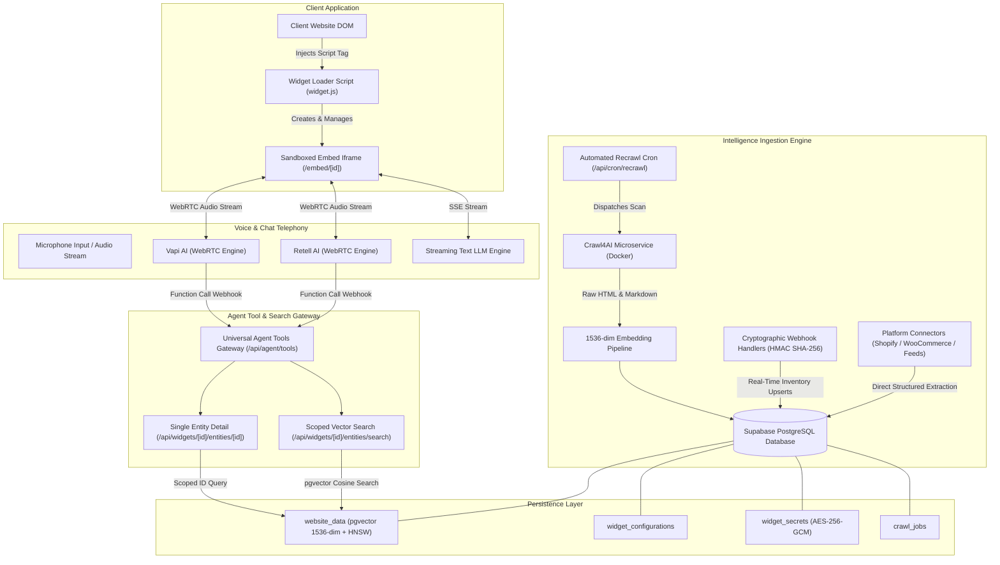
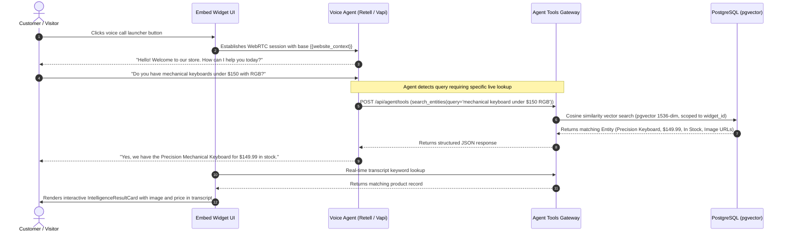

# Front Desk — Enterprise AI Voice & Website Intelligence Platform

Front Desk is an embeddable AI voice and chat widget platform designed for enterprise and e-commerce websites. It combines real-time WebRTC voice telephony, streaming text chat, autonomous web crawling, high-dimensional vector embeddings, platform connectors, and dynamic tool execution to provide voice agents that understand site inventory, documentation, pricing, and services.

---

## Table of Contents

1. [System Architecture](#system-architecture)
2. [End-to-End Sequence Workflow](#end-to-end-sequence-workflow)
3. [Core Feature Breakdown](#core-feature-breakdown)
   - [Real-Time Telephony & Dual-Provider Voice Engine](#real-time-telephony--dual-provider-voice-engine)
   - [Website Intelligence & Ingestion Subsystem](#website-intelligence--ingestion-subsystem)
   - [High-Dimensional Vector Embeddings & Semantic Search](#high-dimensional-vector-embeddings--semantic-search)
   - [E-Commerce & Platform Connectors](#e-commerce--platform-connectors)
   - [Automated Synchronization & Real-Time Webhooks](#automated-synchronization--real-time-webhooks)
   - [Agent Integration & Dynamic Tool Calling](#agent-integration--dynamic-tool-calling)
   - [Visual Customizer & White-Label Theming](#visual-customizer--white-label-theming)
   - [Embeddable Widget Bridge & Client Integration](#embeddable-widget-bridge--client-integration)
4. [Data Storage & State Architecture](#data-storage--state-architecture)
5. [Complete API Reference](#complete-api-reference)
6. [Security, Cryptography & Compliance](#security-cryptography--compliance)
7. [Environment Configuration](#environment-configuration)
8. [Local Development & Automated Testing](#local-development--automated-testing)

---

## System Architecture



---

## End-to-End Sequence Workflow



---

## Core Feature Breakdown

### Real-Time Telephony & Dual-Provider Voice Engine
- **Multi-Provider Architecture**: Supports both Retell AI and Vapi AI using a unified configuration layer. The client widget seamlessly abstracts provider-specific WebRTC handshakes.
- **Bi-Directional Audio Streaming**: Low-latency voice streaming with visual speaking indicators, live volume meter animations, microphone mute toggles, and duration timers.
- **Partial Speech & Real-Time Transcripts**: Live speech-to-text transcripts render user speech and agent replies in real time with word-by-word streaming.
- **Streaming Text Chat Fallback**: Full conversational text chat tab with markdown rendering, message history, typing indicators, and seamless voice-to-text switching.

### Website Intelligence & Ingestion Subsystem
- **Headless Crawl4AI Engine**: Integrated containerized browser crawler supporting JavaScript-heavy single-page applications and responsive DOM trees.
- **Intelligent URL Seeding**: `AsyncUrlSeeder` provides sitemap-driven discovery with Quick Scan (15-page ceiling) and Master Scan (150-page ceiling) execution modes.
- **Multi-Tier Anti-Bot & WAF Challenge Isolation**: Proactively detects Cloudflare, Akamai, Datadome, and AWS WAF firewall challenge pages. Blocked pages are counted, isolated from the vector database, and surfaced in the scan status dashboard.
- **Responsive Media Extraction**: High-resolution image parser extracts `<picture>` and `srcset` tags, selecting maximum resolution assets (`2048w`) and identifying CDN hostnames (Shopify CDN, Cloudinary, Bunny, ImageKit).

### High-Dimensional Vector Embeddings & Semantic Search
- **pgvector Vector Database**: PostgreSQL vector extension enabled with 1536-dimensional vectors and HNSW cosine distance indexing (`vector_cosine_ops`).
- **Automated Batch Embedding Generation**: Centralized embedding pipeline generates embeddings via OpenAI `text-embedding-3-small` with automatic fallbacks for offline testing.
- **Precedence-Aware Knowledge Storage**: Generic, domain-agnostic `Entity` schema holding titles, descriptions, categories, prices, currencies, ratings, variants, and structured metadata.

### E-Commerce & Platform Connectors
- **Shopify Platform Connector**: Connects directly to public `/products.json` endpoints to pull structured product catalogs, images, prices, variants, and inventory status without crawling HTML.
- **WooCommerce Platform Connector**: Authenticated REST API connector (`/wp-json/wc/v3/products`) utilizing AES-256-GCM encrypted consumer credentials with live verification probes.
- **Universal Feed Importer**: Ingests remote product catalogs across CSV, JSON arrays, RSS 2.0, and Google Merchant Center XML formats.
- **Manual Inventory File Upload**: Browser-based CSV and JSON file upload utility with per-row schema validation and granular error reporting.
- **Precedence Merging Engine**: Merges crawled data into existing connector records, ensuring authoritative platform data (pricing, stock) is never overwritten by crawler heuristics.

### Automated Synchronization & Real-Time Webhooks
- **Configurable Sync Schedules**: Granular recurring re-crawl intervals (`weekly`, `daily`, `twice_daily`, `three_times_daily`, `off`) managed via `/api/cron/recrawl` and cron triggers.
- **Incremental Content Hashing**: Computes normalized SHA-256 digests (`computeContentHash`) on raw page content. Unchanged pages bypass LLM extraction and vector re-embedding, updating only `last_checked_at`.
- **Shopify Webhooks**: Cryptographically verified endpoint (`/api/webhooks/shopify`) validating `X-Shopify-Hmac-Sha256` signatures and executing real-time product updates and deletions.
- **WooCommerce Webhooks**: Cryptographically verified endpoint (`/api/webhooks/woocommerce`) validating `X-WC-Webhook-Signature` against stored AES-256 secrets.
- **Zero-Touch Auto-Provisioning**: Connecting a WooCommerce store automatically registers product webhooks with the remote store API with zero manual configuration.

### Agent Integration & Dynamic Tool Calling
- **Callable Tool Schemas**: Pre-configured function definitions for Retell AI (`custom_tool`) and Vapi AI (`function_call`):
  - `search_entities`: Real-time vector search across widget knowledge.
  - `get_entity_details`: Live single-entity specification and pricing confirmation.
- **Universal Tool Webhook Gateway**: `/api/agent/tools` dynamically resolves widget scope, executes the query, and formats tool outputs for voice synthesizers.
- **Cross-Widget Isolation**: All vector queries, entity lookups, and tool invocations are strictly isolated by `widget_id`.

### Visual Customizer & White-Label Theming
- **Real-Time Visual Customizer**: Comprehensive editor (`/widget-customizer`) with instant preview updates across themes, launcher buttons, panel dimensions, and typography.
- **Precision Color Engine**: Integrated `@jaames/iro` color picker supporting primary, background, text, user bubble, and agent bubble customization.
- **Typography & Layout Controls**: Configurable font families, scale multipliers, border radiuses, box shadows, and full-screen mobile responsive modes.

### Embeddable Widget Bridge & Client Integration
- **Single Script Embed**: Lightweight loader (`public/widget.js`) dynamically mounted on any client web page with a single `<script data-widget-id="...">` tag.
- **Cross-Origin PostMessage Protocol**: Secure messaging bridge coordinating panel expansion, dimension resizing, audio stream state, and customizer live reloading.
- **Standalone Embed Route**: Isolated iframe container (`/embed/[widgetId]`) with SSR hydration safeguards and domain whitelist enforcement.

---

## Data Storage & State Architecture

The persistence layer is architected around PostgreSQL with Row Level Security (RLS) and pgvector:

- **Websites & Tenant Scope (`websites`)**: Stores registered website domains, CSS extraction configurations, detected platforms, and recurring synchronization schedules.
- **Encrypted Secrets Store (`widget_secrets`)**: Stores third-party connector credentials (e.g., WooCommerce Consumer Keys & Secrets) encrypted at rest using AES-256-GCM.
- **Knowledge Entity Store (`website_data`)**: Stores all extracted and connector-sourced entities alongside 1536-dimensional OpenAI vector embeddings, indexed with HNSW cosine distance (`vector_cosine_ops`), content hashes, and freshness timestamps.
- **Crawl Execution Registry (`crawl_jobs`)**: Tracks asynchronous crawler jobs, recording execution status (`pending`, `running`, `completed`, `failed`, `blocked`), visited page counts, and WAF challenge metrics.
- **Widget Configuration Store (`widget_configurations`)**: Persists complete visual theming, color tokens, typography scales, launcher geometries, and panel dimensions.

---

## Complete API Reference

### Widget & Entity Operations
| Route | Method | Description | Request Parameters | Response |
|---|---|---|---|---|
| `/api/widgets/[widgetId]` | `GET` | Fetches widget configuration & telephony keys | None | `{ widget, configuration }` |
| `/api/widgets/[widgetId]` | `PUT` | Updates widget branding, theme, or telephony | JSON configuration object | `{ widget }` |
| `/api/widgets/[widgetId]/entities/search` | `GET` / `POST` | Scoped vector similarity & keyword search | `{ query: string, limit?: number }` | `{ entities: Entity[], count: number }` |
| `/api/widgets/[widgetId]/entities/[entityId]` | `GET` | Scoped single entity lookup by ID | None | `{ entity: Entity }` |

### Web Intelligence & Connectors
| Route | Method | Description | Request Parameters | Response |
|---|---|---|---|---|
| `/api/websites` | `GET` | Lists all connected websites | None | `Website[]` |
| `/api/websites` | `POST` | Connects domain & triggers auto-detection | `{ domain: string, name?: string }` | `{ website, detectedPlatform }` |
| `/api/websites/[id]` | `PUT` | Updates sync frequency or CSS schemas | `{ syncFrequency?, cssSelectorSchema? }` | `{ website }` |
| `/api/websites/[id]/crawl` | `POST` | Triggers background crawl job | `{ scanMode: 'quick' \| 'master' }` | `{ jobId, status }` |
| `/api/websites/[id]/connect-platform` | `POST` | Verifies and encrypts connector keys | `{ platform, consumerKey, consumerSecret }` | `{ success, ingestedCount }` |
| `/api/websites/[id]/import-feed` | `POST` | Imports remote product feed URL | `{ feedUrl: string }` | `{ success, count }` |
| `/api/websites/[id]/upload-inventory` | `POST` | Processes multipart CSV/JSON file | Form data with file | `{ success, imported, rejected }` |

### Agent Webhooks & Cron Automation
| Route | Method | Description | Request Headers / Body | Response |
|---|---|---|---|---|
| `/api/agent/tools` | `POST` | Universal Retell & Vapi tool gateway | Retell / Vapi tool payload | Structured tool response |
| `/api/webhooks/shopify` | `POST` | Shopify product update webhook | `X-Shopify-Hmac-Sha256`, raw body | `{ success, action, productId }` |
| `/api/webhooks/woocommerce` | `POST` | WooCommerce product update webhook | `X-WC-Webhook-Signature`, raw body | `{ success, action, productId }` |
| `/api/cron/recrawl` | `GET` / `POST` | Background scheduled re-crawl worker | `Authorization: Bearer <CRON_SECRET>` | `{ summary, triggeredJobs }` |

---

## Security, Cryptography & Compliance

- **AES-256-GCM Credential Encryption**: All third-party platform API credentials stored in `widget_secrets` are encrypted at rest using Galois/Counter Mode authenticated encryption with randomized 16-byte initialization vectors.
- **Cryptographic Webhook Verification**: Inbound webhooks from Shopify and WooCommerce require valid HMAC-SHA256 signatures evaluated using `crypto.timingSafeEqual` to prevent timing attacks. Unsigned or invalid requests are rejected immediately with HTTP 401.
- **Widget-Level Isolation**: All search queries, database reads, and tool executions enforce strict `widget_id` scoping to prevent multi-tenant data contamination.
- **Fail-Closed Architecture**: Any failure in cryptographic verification or credential authentication fails closed with zero state modifications.

---

## Environment Configuration

Create a `.env.local` file in the root directory with the following variables:

```ini
# Supabase Configuration
NEXT_PUBLIC_SUPABASE_URL=https://your-project.supabase.co
NEXT_PUBLIC_SUPABASE_ANON_KEY=your-anon-key
SUPABASE_SERVICE_ROLE_KEY=your-service-role-key

# Vector Embeddings
OPENAI_API_KEY=sk-...
# or GROQ_API_KEY=gsk-...

# Crawl4AI Microservice
CRAWL4AI_BASE_URL=http://localhost:11235
CRAWL4AI_API_KEY=

# Cryptography & Security Secrets
ENCRYPTION_KEY=0123456789abcdef0123456789abcdef0123456789abcdef0123456789abcdef
SHOPIFY_WEBHOOK_SECRET=your-shopify-webhook-secret
CRON_SECRET=your-cron-secret-token

# Telephony Providers
RETELL_API_KEY=key_...
VAPI_PUBLIC_KEY=...
```

---

## Local Development & Automated Testing

### Installation & Server Startup

```bash
# 1. Install Node.js dependencies
npm install

# 2. Start the Crawl4AI Docker container
docker-compose up -d

# 3. Start the Next.js development server
npm run dev

# 4. Perform TypeScript type check
npx tsc --noEmit
```

### Automated Verification Test Suites

```bash
# Run regression test suite (Phases 0.1 through 4.6)
npx tsx scratch/test-all-phases-0-to-4.ts

# Run synchronization and webhook test suite (Phase 5)
npx tsx scratch/test-all-phase-5.ts

# Run agent tools and vector search test suite (Phase 6.1)
npx tsx scratch/test-agent-tools.ts
```
