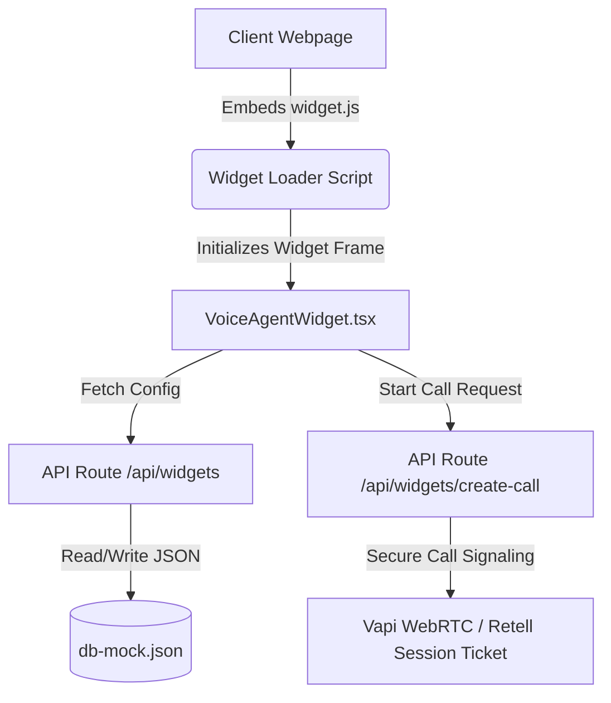

# Voice Agent Widget Customizer

This project is a highly professional, white-labeled visual customizer and runtime delivery engine for AI Voice Receptionist widgets. It supports both **Retell AI** and **Vapi AI** voice agent providers.

---

## Key Features & Functionalities

### 1. Visual Customizer Workspace (`/widget-customizer`)
An interactive dashboard split into three core zones to create, edit, and fine-tune front-desk widgets:
- **Navigation Sidebar:** Toggle between setting categories: Identity/Credentials, Branding, Colors/Theme, Typography, Launcher shape, Panel layout, Conversational Behavior, and Responsive rules.
- **Property Editors:**
  - **Color Sync Engine:** Integrates a circular visual color picker (`@jaames/iro`) for real-time CSS variable updates.
  - **Customizable Messaging:** Edit greeting messages, system error warnings, title/subtitles, user labels, and tab controls (text vs. voice).
  - **Identity settings:** Configure slug identifiers, widget name, and provider properties.
- **Real-Time Preview Panel:** Highlights visual modifications instantly inside a simulated desktop container.

### 2. Multi-Provider Integration (Retell AI & Vapi AI)
- **Vapi Support:** Implements client-side WebRTC voice streaming using standard UUID-based public keys and Vapi Assistant IDs.
- **Retell Support:** Integrates with the Retell Web Client SDK, exposing secure server-side routes to create call tokens while isolating sensitive credentials from the browser.
- **Key Validation & Safety:** Protects security protocols by blocking public exposure of private keys (like Vapi `pvk_` keys).

### 3. Embed System & Sandbox Preview
- **Dynamic Embed Script:** Generates a lightweight, async script tag referencing the platform origin:
  ```html
  <!-- Voice Agent Widget -->
  <script
    src="http://localhost:3000/widget.js"
    data-widget-id="myfrontdesk"
    defer
  ></script>
  ```
- **White-Labeled Embed Route (`/embed/[id]`):** Serves client websites dynamically, loading custom theme presets and visual overrides from database records.
- **Isolated Sandbox:** Previews the exact runtime widget behaviour inside an iframe within the customizer.

### 4. Responsive Layout & Aesthetics
- **Desktop Panel:** Optimized height parameters (`max-height: 400px`) anchored at customizable corner offsets to stay non-intrusive.
- **Mobile Capping:** Prevents fullscreen takeover on small devices (width capped to `min(340px, calc(100vw - 32px))` and height to `min(420px, 70vh)`) unless `fullscreenOnMobile` is explicitly enabled.
- **Smooth Animations:** Pre-configured CSS visual queues, pulsing rings for active voice calls, speaking indicator waveforms, and modern typography mapping (e.g., Figtree).

---

## Technical Architecture & Working



### 1. Centralized State Registry (`src/config/voiceWidget/`)
- **`default.ts`**: The single source of truth for the complete configuration structure. Sets fallback parameters for all widgets.
- **`types.ts`**: Strict TypeScript interfaces specifying theme tokens, avatar attributes, behavioral features, and animation settings.
- **`clients/`**: Static presets for rapid deployment (e.g. `darkSaaS`, `clinicA`).
- **`registry.ts`**: Houses the dynamic merging helper (`deepMerge`) that blends default settings with client-specific databases and page overrides.

### 2. API Routes
- **`GET /api/widgets?id={slug}`**: Resolves client-specific configurations, stripping out secret keys before returning state data to the browser.
- **`POST /api/widgets`**: Persists customized visual configurations directly to the database.
- **`POST /api/widgets/create-call`**: Resolves provider credentials (API Keys, Assistant/Agent IDs) and initializes standard session telemetry logging.
