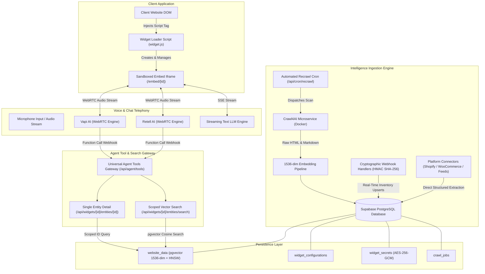
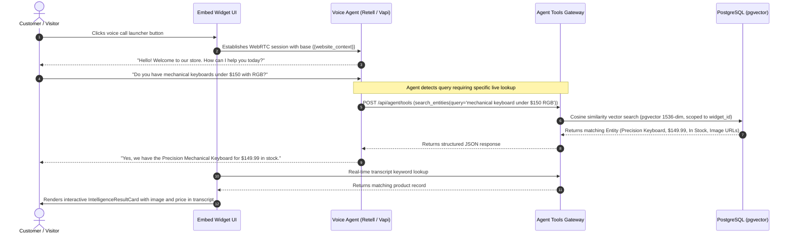

# Widgetized— Enterprise AI Voice & Website Intelligence Platform

Widgetized is an embeddable AI voice and chat widget platform designed for enterprise and e-commerce websites. It combines real-time WebRTC voice telephony, streaming text chat, autonomous web crawling, high-dimensional vector embeddings, platform connectors, and dynamic tool execution to provide voice agents that understand site inventory, documentation, pricing, and services.

---

## Table of Contents

1. [System Architecture](#system-architecture)
2. [End-to-End Sequence Workflow](#end-to-end-sequence-workflow)
3. [Core Feature Breakdown](#core-feature-breakdown)
   - [Real-Time Telephony & Dual-Provider Voice Engine](#real-time-telephony--dual-provider-voice-engine)
   - [Website Intelligence & Ingestion Subsystem](#website-intelligence--ingestion-subsystem)
   - [High-Dimensional Vector Embeddings & Semantic Search](#high-dimensional-vector-embeddings--semantic-search)
   - [E-Commerce & Platform Connectors](#e-commerce--platform-connectors)
   - [Automated Synchronization & Real-Time Webhooks](#automated-synchronization--real-time-webhooks)
   - [Agent Integration & Dynamic Tool Calling](#agent-integration--dynamic-tool-calling)
   - [Visual Customizer & White-Label Theming](#visual-customizer--white-label-theming)
   - [Embeddable Widget Bridge & Client Integration](#embeddable-widget-bridge--client-integration)
4. [Data Storage & State Architecture](#data-storage--state-architecture)
5. [Complete API Reference](#complete-api-reference)
6. [Security, Cryptography & Compliance](#security-cryptography--compliance)
7. [Environment Configuration](#environment-configuration)
8. [Local Development & Automated Testing](#local-development--automated-testing)

---

## System Architecture



---

## End-to-End Sequence Workflow



---

## Core Feature Breakdown

### Real-Time Telephony & Dual-Provider Voice Engine
- **Multi-Provider Architecture**: Supports both Retell AI and Vapi AI using a unified configuration layer. The client widget seamlessly abstracts provider-specific WebRTC handshakes.
- **Bi-Directional Audio Streaming**: Low-latency voice streaming with visual speaking indicators, live volume meter animations, microphone mute toggles, and duration timers.
- **Partial Speech & Real-Time Transcripts**: Live speech-to-text transcripts render user speech and agent replies in real time with word-by-word streaming.
- **Streaming Text Chat Fallback**: Full conversational text chat tab with markdown rendering, message history, typing indicators, and seamless voice-to-text switching.

### Website Intelligence & 5-Tier Universal Ingestion Subsystem
The ingestion pipeline is architected around a resilient, multi-strategy fallback hierarchy designed to extract structured catalog data from any web architecture—from server-rendered static HTML to decoupled Single Page Applications (SPAs):

- **5-Tier Extraction Hierarchy**:
  - **Tier 1 (JSON-LD & Schema.org)**: Direct extraction of structured `@type: Product`, `@type: Vehicle`, `@type: Service`, `@type: Course`, `@type: LocalBusiness`, and `@type: FAQPage`.
  - **Tier 2 (Dynamic AJAX & REST API Discovery)**: Automated discovery and interrogation of inline API routes and client-side backend endpoints (e.g. Render, Railway, Redux `apiSlice`, Next.js `/api/v1` routes) uncovered from SPA JavaScript bundle chunks.
  - **Tier 3 (User-Defined CSS Selector Schemas)**: Precision visual selector mapping for custom dealership, real estate, or enterprise inventory structures.
  - **Tier 4 (LLM-Assisted Structured Extraction)**: Context-aware LLM extraction converting unstructured DOM blocks into normalized JSON catalog entities.
  - **Tier 5 (SPA Bundle Chunks & Responsive HTML Fallback)**: Client-side component decompilation extracting catalog item arrays, media, pricing, and descriptions.
- **Fail-Fast Hybrid Crawler**: Combines containerized Crawl4AI browser automation with high-speed native extraction. Automatically falls back to native crawling on microservice timeout without stalling.
- **Responsive Media & High-Res Image Extraction**: Automatically aggregates image URLs from `image_urls`, `metadata.images`, `metadata.thumbnail`, and responsive `<picture>` tags, selecting highest-resolution assets and CDN-hosted graphics (Cloudinary, Shopify CDN, Bunny, ImageKit).

### Universal Vertical & Industry Adapters
The platform features built-in intelligence adapters tailored to diverse business models:
- **Next.js & React SPAs (e.g., CampusCore LMS / E-Learning)**: Automatically decompiles `<script>` bundle chunks, uncovers external backend endpoints (e.g., Render, Railway, Heroku, Vercel), and extracts course catalogs, curriculum difficulty levels, tags, and Cloudinary thumbnail assets.
- **Automotive Dealerships (e.g., Ottawa Chrysler Jeep Dodge)**: Proactively extracts 17-digit VIN identifiers, odometer mileage, trim levels, transmission, engine specifications, MSRP/sale pricing, and high-resolution vehicle photo galleries.
- **E-Commerce Stores (Shopify & WooCommerce)**: Real-time cryptographic webhook streams, SKU matching, multi-variant tracking, live inventory availability, and product catalogs via native JSON/REST connectors.
- **Professional Services & Booking Businesses (Clinics, Salons, Law Firms)**: Ingests service menus, practitioner profiles, appointment durations, hourly rate cards, and direct booking links.

### Freshness Tracking & LLM Confidence Hedging
- **Entity Freshness Lifecycle**: Tracks `first_seen`, `last_seen`, `last_checked_at`, and `still_listed` boolean flags on every entity record.
- **Soft Deletion Signal**: Missing entities are retained with `still_listed = false`, preserving historical knowledge rather than discarding data.
- **LLM Confidence Hedging Directives**: Dynamic system prompts instruct voice and chat agents to modulate their confidence:
  - *Fresh (< 24h)*: Stated with high confidence as active inventory.
  - *Recent (1–7 days)*: Stated normally.
  - *Stale (> 7 days) or Unlisted*: Hedged transparently (e.g. *"Our records show we had this item listed last week; let me verify current availability for you."*).

### Incremental Re-Crawling & Known-URL Fast-Path
- **Known-URL Tracking**: Persists discovered inventory URLs in a JSONB array (`websites.known_urls`).
- **Content-Hash Acceleration**: Computes normalized SHA-256 digests (`computeContentHash`) on raw page content. Unchanged pages bypass re-extraction and vector re-embedding, performing a lightweight `last_seen` timestamp update.

### Interactive Knowledge Viewer & Media Showcase UI
- **Dual Tab Presentation**: Separates **Knowledge Records** (structured products, courses, vehicles, services) from **Site Pages** (raw navigation and content pages).
- **📷 High-Res Photos & Media Showcase**: Visual thumbnail cards with image counters, lightbox hover zoom, and graceful cross-origin / CDN hotlink protection fallback cards (`🔗 Open URL →`).
- **Interactive Search & Filter Intelligence**: Live full-text search across titles, descriptions, categories, and prices with dynamic counter badges.

### High-Dimensional Vector Embeddings & Semantic Search
- **pgvector Vector Database**: PostgreSQL vector extension enabled with 1536-dimensional vectors and HNSW cosine distance indexing (`vector_cosine_ops`).
- **Automated Batch Embedding Generation**: Centralized embedding pipeline generates embeddings via OpenAI `text-embedding-3-small` with automatic fallbacks for offline testing.
- **Precedence-Aware Knowledge Storage**: Generic, domain-agnostic `Entity` schema holding titles, descriptions, categories, prices, currencies, ratings, variants, and structured metadata.

### E-Commerce & Platform Connectors
- **Shopify Platform Connector**: Connects directly to public `/products.json` endpoints to pull structured product catalogs, images, prices, variants, and inventory status without crawling HTML.
- **WooCommerce Platform Connector**: Authenticated REST API connector (`/wp-json/wc/v3/products`) utilizing AES-256-GCM encrypted consumer credentials with live verification probes.
- **Universal Feed Importer**: Ingests remote product catalogs across CSV, JSON arrays, RSS 2.0, and Google Merchant Center XML formats.
- **Manual Inventory File Upload**: Browser-based CSV and JSON file upload utility with per-row schema validation and granular error reporting.
- **Precedence Merging Engine**: Merges crawled data into existing connector records, ensuring authoritative platform data (pricing, stock) is never overwritten by crawler heuristics.

### Automated Synchronization & Real-Time Webhooks
- **Configurable Sync Schedules**: Granular recurring re-crawl intervals (`weekly`, `daily`, `twice_daily`, `three_times_daily`, `off`) managed via `/api/cron/recrawl` and cron triggers.
- **Incremental Content Hashing**: Computes normalized SHA-256 digests (`computeContentHash`) on raw page content. Unchanged pages bypass LLM extraction and vector re-embedding, updating only `last_checked_at`.
- **Shopify Webhooks**: Cryptographically verified endpoint (`/api/webhooks/shopify`) validating `X-Shopify-Hmac-Sha256` signatures and executing real-time product updates and deletions.
- **WooCommerce Webhooks**: Cryptographically verified endpoint (`/api/webhooks/woocommerce`) validating `X-WC-Webhook-Signature` against stored AES-256 secrets.
- **Zero-Touch Auto-Provisioning**: Connecting a WooCommerce store automatically registers product webhooks with the remote store API with zero manual configuration.

### Agent Integration & Dynamic Tool Calling
- **Callable Tool Schemas**: Pre-configured function definitions for Retell AI (`custom_tool`) and Vapi AI (`function_call`):
  - `search_entities`: Real-time vector search across widget knowledge.
  - `get_entity_details`: Live single-entity specification and pricing confirmation.
- **Universal Tool Webhook Gateway**: `/api/agent/tools` dynamically resolves widget scope, executes the query, and formats tool outputs for voice synthesizers.
- **Cross-Widget Isolation**: All vector queries, entity lookups, and tool invocations are strictly isolated by `widget_id`.

### Visual Customizer & White-Label Theming
- **Real-Time Visual Customizer**: Comprehensive editor (`/widget-customizer`) with instant preview updates across themes, launcher buttons, panel dimensions, typography, and prompt templates.
- **Precision Color Engine**: Integrated color pickers supporting primary, background, text, user bubble, and agent bubble customization.
- **Dynamic Google Fonts Typography**: Curated Google Fonts picker (Inter, Outfit, Plus Jakarta Sans, Poppins, Roboto, Montserrat, Space Grotesk, Playfair Display, etc.) with automated runtime stylesheet injection.
- **Template Messages & Starter Prompts Library**: Visual manager in customizer with quick-load presets for Education/LMS, Dealerships/Automotive, and General Business. Renders interactive prompt chips inside the chat.

### Embeddable Widget Bridge & Client Integration
- **Zero-Latency Embed Mounting**: Instant rendering without placeholder blocking spinners while dynamically hydrating tenant configurations in the background.
- **Session-Preserved Host Navigation**: Restores active conversation transcripts across multi-page host transitions via `sessionStorage` and automatic reopen triggers.
- **Template Messages & Starter Prompts**: Interactive inquiry chips for fast visitor engagement with customizable presets for LMS, Auto, and General Business.
- **Specialized Intent Routing & Dynamic Fallbacks**: Zero-LLM fallback handlers accurately distinguish between Pricing/Tuition, Admissions/Requirements, and Mentorship/Instructor queries, delivering tailored answers rather than generic catalog dumps.
- **Rich Markdown Hyperlinks & Clean Price Rendering**: In-bubble markdown parser with clickable `<a>` links and auto-sanitized single-symbol currency formatting (`$150`, not `$$150`).
- **Catalog vs. Explicit Navigation Disambiguation**: General queries ("what courses/products do you offer?") stay in chat presenting top 5-6 cards with prices, details, and hyperlinks; explicit navigation requests ("take me to course X") execute host redirection.
- **Sub-Second WebRTC Call Setup**: In-memory summary TTL caching, lightweight DB query projections, and SDK pre-warming accelerate voice call initiation to under 1.5 seconds.
- **Mobile-Responsive Customizer**: Full fluid breakpoints for screens under 640px/900px, prevent horizontal overflow in template message inputs, and provide compact touch-friendly toolbars.
- **Cross-Origin PostMessage Protocol**: Secure messaging bridge coordinating panel expansion, dimension resizing, audio stream state, and customizer live reloading.
- **Standalone Embed Route**: Isolated iframe container (`/embed/[widgetId]`) with SSR hydration safeguards and domain whitelist enforcement.

### Comprehensive Abuse Prevention & Spending Circuit Breakers
- **C.1 Hard Server-Side Duration & Turn Caps**: Server-enforced call duration limits (`maxCallDurationMinutes`, default 10 min) and chat turn caps (`maxChatTurns`, default 30 turns).
- **C.2 Silence-Based Auto-Hangup**: Server-side watchdog (`initialSilenceTimeoutSeconds`, default 15s) terminating silent calls while preserving normal conversational pauses upon speech detection.
- **C.3 Per-Widget Spend Cap with Circuit Breaker**: Date-partitioned daily usage counters (`maxDailyCalls: 100`, `maxDailyChats: 500`) with UTC midnight rollover and circuit breaker tripping.
- **C.4 Session-Based Rate Limiting & Duplicate Throttling**: Session-scoped sliding window rate limiter (15 msg/min), duplicate message throttling with static instant replies (0 LLM calls), and 1,000-character single-message caps.

---

## Data Storage & State Architecture

The persistence layer is architected around PostgreSQL with Row Level Security (RLS) and pgvector:

- **Websites & Tenant Scope (`websites`)**: Stores registered website domains, CSS extraction configurations, detected platforms, and recurring synchronization schedules.
- **Encrypted Secrets Store (`widget_secrets`)**: Stores third-party connector credentials (e.g., WooCommerce Consumer Keys & Secrets) encrypted at rest using AES-256-GCM.
- **Knowledge Entity Store (`website_data`)**: Stores all extracted and connector-sourced entities alongside 1536-dimensional OpenAI vector embeddings, indexed with HNSW cosine distance (`vector_cosine_ops`), content hashes, and freshness timestamps.
- **Crawl Execution Registry (`crawl_jobs`)**: Tracks asynchronous crawler jobs, recording execution status (`pending`, `running`, `completed`, `failed`, `blocked`), visited page counts, and WAF challenge metrics.
- **Widget Configuration Store (`widget_configurations`)**: Persists complete visual theming, color tokens, typography scales, launcher geometries, and panel dimensions.

---

## Complete API Reference

### Widget & Entity Operations
| Route | Method | Description | Request Parameters | Response |
|---|---|---|---|---|
| `/api/widgets/[widgetId]` | `GET` | Fetches widget configuration & telephony keys | None | `{ widget, configuration }` |
| `/api/widgets/[widgetId]` | `PUT` | Updates widget branding, theme, or telephony | JSON configuration object | `{ widget }` |
| `/api/widgets/[widgetId]/entities/search` | `GET` / `POST` | Scoped vector similarity & keyword search | `{ query: string, limit?: number }` | `{ entities: Entity[], count: number }` |
| `/api/widgets/[widgetId]/entities/[entityId]` | `GET` | Scoped single entity lookup by ID | None | `{ entity: Entity }` |

### Web Intelligence & Connectors
| Route | Method | Description | Request Parameters | Response |
|---|---|---|---|---|
| `/api/websites` | `GET` | Lists all connected websites | None | `Website[]` |
| `/api/websites` | `POST` | Connects domain & triggers auto-detection | `{ domain: string, name?: string }` | `{ website, detectedPlatform }` |
| `/api/websites/[id]` | `PUT` | Updates sync frequency or CSS schemas | `{ syncFrequency?, cssSelectorSchema? }` | `{ website }` |
| `/api/websites/[id]/crawl` | `POST` | Triggers background crawl job | `{ scanMode: 'quick' \| 'master' }` | `{ jobId, status }` |
| `/api/websites/[id]/connect-platform` | `POST` | Verifies and encrypts connector keys | `{ platform, consumerKey, consumerSecret }` | `{ success, ingestedCount }` |
| `/api/websites/[id]/import-feed` | `POST` | Imports remote product feed URL | `{ feedUrl: string }` | `{ success, count }` |
| `/api/websites/[id]/upload-inventory` | `POST` | Processes multipart CSV/JSON file | Form data with file | `{ success, imported, rejected }` |

### Agent Webhooks & Cron Automation
| Route | Method | Description | Request Headers / Body | Response |
|---|---|---|---|---|
| `/api/agent/tools` | `POST` | Universal Retell & Vapi tool gateway | Retell / Vapi tool payload | Structured tool response |
| `/api/webhooks/shopify` | `POST` | Shopify product update webhook | `X-Shopify-Hmac-Sha256`, raw body | `{ success, action, productId }` |
| `/api/webhooks/woocommerce` | `POST` | WooCommerce product update webhook | `X-WC-Webhook-Signature`, raw body | `{ success, action, productId }` |
| `/api/cron/recrawl` | `GET` / `POST` | Background scheduled re-crawl worker | `Authorization: Bearer <CRON_SECRET>` | `{ summary, triggeredJobs }` |

---

## Security, Cryptography & Compliance

- **AES-256-GCM Credential Encryption**: All third-party platform API credentials stored in `widget_secrets` are encrypted at rest using Galois/Counter Mode authenticated encryption with randomized 16-byte initialization vectors.
- **Cryptographic Webhook Verification**: Inbound webhooks from Shopify and WooCommerce require valid HMAC-SHA256 signatures evaluated using `crypto.timingSafeEqual` to prevent timing attacks. Unsigned or invalid requests are rejected immediately with HTTP 401.
- **Widget-Level Isolation**: All search queries, database reads, and tool executions enforce strict `widget_id` scoping to prevent multi-tenant data contamination.
- **Fail-Closed Architecture**: Any failure in cryptographic verification or credential authentication fails closed with zero state modifications.

---

## Environment Configuration

Create a `.env.local` file in the root directory with the following variables:

```ini
# Supabase Configuration
NEXT_PUBLIC_SUPABASE_URL=https://your-project.supabase.co
NEXT_PUBLIC_SUPABASE_ANON_KEY=your-anon-key
SUPABASE_SERVICE_ROLE_KEY=your-service-role-key

# Vector Embeddings
OPENAI_API_KEY=sk-...
# or GROQ_API_KEY=gsk-...

# Crawl4AI Microservice
CRAWL4AI_BASE_URL=http://localhost:11235
CRAWL4AI_API_KEY=

# Cryptography & Security Secrets
ENCRYPTION_KEY=0123456789abcdef0123456789abcdef0123456789abcdef0123456789abcdef
SHOPIFY_WEBHOOK_SECRET=your-shopify-webhook-secret
CRON_SECRET=your-cron-secret-token

# Telephony Providers
RETELL_API_KEY=key_...
VAPI_PUBLIC_KEY=...
```

---

## Local Development & Automated Testing

### Installation & Server Startup

```bash
# 1. Install Node.js dependencies
npm install

# 2. Start the Crawl4AI Docker container
docker-compose up -d

# 3. Start the Next.js development server
npm run dev

# 4. Perform TypeScript type check
npx tsc --noEmit
```

### Automated Verification Test Suites

```bash
# Run regression test suite (Phases 0.1 through 4.6)
npx tsx scratch/test-all-phases-0-to-4.ts

# Run synchronization and webhook test suite (Phase 5)
npx tsx scratch/test-all-phase-5.ts

# Run universal chat intent, navigation & constraint test suite
npx tsx scratch/test-universal-chat-engine.ts

# Run hard duration and chat turn caps test suite (Task C.1)
npx tsx scratch/test-duration-and-turn-caps.ts

# Run silence-based auto-hangup test suite (Task C.2)
npx tsx scratch/test-silence-auto-hangup.ts

# Run per-widget spend cap with circuit breaker test suite (Task C.3)
npx tsx scratch/test-spend-circuit-breaker.ts

# Run session-based chat rate limiting and duplicate throttling test suite (Task C.4)
npx tsx scratch/test-chat-session-throttle.ts
```

---

## Hard Duration, Turn Caps, Silence Hangup, Spend Circuit Breakers & Chat Throttling (Cost & Abuse Protection)

Widgetized enforces strict, unavoidable server-side rate, duration, silence, volume, and repetition boundaries to eliminate uncapped cost exposure from runaway or abusive client sessions:

1. **Server-Side Hard Call Duration Cap**:
   - Configurable per widget under the **Behavior** settings via `maxCallDurationMinutes` (default: 10 minutes, tunable from 1–60 min).
   - Enforced by `src/lib/voice/callLimiter.ts`: An active server-side timeout monitors the live call and terminates it directly via provider APIs (`client.call.stop` for Retell, `DELETE /call/:id` or `maxDurationSeconds` for Vapi) when the cap is reached—ensuring a rogue or altered client cannot keep an audio stream open indefinitely.
2. **Server-Side Hard Chat Turn Cap**:
   - Configurable per widget under **Behavior** via `maxChatTurns` (default: 30 user message turns).
   - Enforced directly in `/api/retell/chat` by `src/lib/chat/chatLimiter.ts`: When a session exceeds its configured turn limit, the server immediately stops all upstream LLM generations, embedding lookups, and third-party API calls, returning a fixed contact redirect message (*"You have reached the maximum message limit for this chat session. Please contact our team directly for further assistance."*).
3. **Silence-Based Auto-Hangup (Initial Window)**:
   - Configurable per widget under **Behavior** via `initialSilenceTimeoutSeconds` with tunable constant fallback `DEFAULT_INITIAL_SILENCE_TIMEOUT_SECONDS = 15`.
   - Protects against prank/ghost calls where a caller connects and stays silent to run up telephony minutes.
   - If no user speech is detected during the first ~10–15 seconds, the server terminates the call immediately.
   - As soon as caller speech is detected (`user_start_talking` in Retell, `speech-start` in Vapi, or user transcript entries), the watchdog is permanently disarmed for that session, ensuring natural conversational pauses during real dialogue are completely unaffected.
4. **Per-Widget Daily Spend Cap & Circuit Breaker**:
   - Configurable per widget under **Behavior** via `maxDailyCalls` (default: 100/day) and `maxDailyChats` (default: 500/day).
   - Enforced by `src/lib/usage/spendLimiter.ts`: Tracks daily call and chat starts against configurable daily thresholds.
   - When a widget exceeds its daily limit, the circuit breaker automatically trips, disabling all new call and chat starts for that widget for the remainder of the day and returning a clear visitor fallback message (*"This assistant is temporarily unavailable. Please try again later or contact us directly."*).
   - **Dashboard Indicator**: Prominently flags the widget card with an alert badge (*"⚠️ Circuit Breaker: Daily Spend Cap Reached"*) and displays daily quota counters (`📞 Calls: X/Y • 💬 Chats: A/B`).
   - **Automatic Rollover**: Auto-resets at UTC midnight date partition boundaries without requiring manual intervention.
   - **Fail-Safe Operation**: Fails open with logged warnings if tracking errors occur, ensuring tracking failures never become an outage.
5. **Session-Scoped Chat Rate Limiting & Duplicate Throttling**:
   - Configurable per widget under **Behavior** via `chatRateLimitPerMinute` (default: 15 msg/min per session) and `maxMessageCharacters` (default: 1000 characters).
   - **Sliding-Window Rate Limiter**: Evaluates message rate per session identifier (`chatId || sessionId || ip`), throttling rapid bursts (HTTP 429) independently of IP-level limits.
   - **Duplicate-Message Throttling**: When a visitor repeatedly sends identical message text in rapid succession, skips invoking upstream LLM calls after the threshold (default: 2 repeats) and returns a lightweight static answer (*"I've already answered that — is there something else I can help with?"*), consuming 0 LLM tokens.
   - **Message Length Cap**: Rejects oversized inputs (>1,000 chars) before tokenization or vector lookup.
6. **Pre-Filled Baseline Protection**:
   - Pre-filled sensible defaults (`10 min` max call duration, `30 turns` max chat session, `15s` silence watchdog, `100 calls/day`, `500 chats/day`, `15 msg/min`, `1,000 char cap`) protect all existing and newly created widgets out-of-the-box with zero initial setup required.

---

## Autonomous Host Page Navigation & Dynamic Filtering

Widgetized features a bi-directional event bridge allowing the AI agent (via text chat or voice telephony) to autonomously navigate the user's host browser to specific pages, filter catalog items dynamically, and keep cost-effective in-session memory:

1. **Autonomous Host Navigation**:
   - The embed iframe dispatches `postMessage({ type: 'WIDGET_NAVIGATE', url })` and `voice-agent-navigate` events to the parent host window.
   - The host listener (`widget.js`) inspects the target URL and executes immediate `window.location.href` navigation.
2. **Multi-Dimensional Constraint Engine**:
   - **Numeric Budget & Pricing**: Automatically parses user intents such as `under $100`, `between $50 and $100`, `cheapest`, and filters entities dynamically.
   - **Specific Item Isolation**: When a specific title/keyword is mentioned (e.g., `"MERN Stack Course"`), the engine isolates retrieval to that exact entity and returns 1 high-confidence card with its direct deep link (`/course/:id`, `/inventory/:id`, `/products/:slug`).
   - **Informational Intent Routing**: Static page queries (e.g. `"About Us"`, `"Privacy Policy"`, `"Terms"`, `"FAQ"`) synthesize concise answers and suppress unrelated catalog product cards.
3. **In-Session Context Memory**:
   - Conversations maintain active memory scoped strictly to the current opened widget chat (`chatMessages.slice(-6)`), eliminating stale multi-session context contamination and minimizing token consumption.

```bash
# Run agent tools and vector search test suite (Phase 6.1)
npx tsx scratch/test-agent-tools.ts
```
